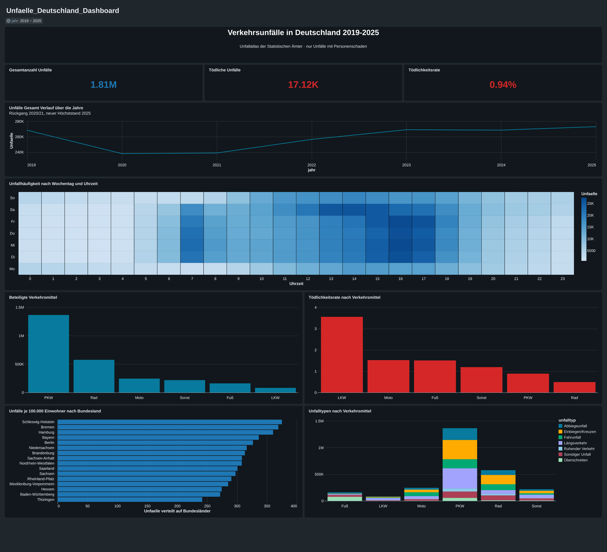

# Verkehrsunfälle in Deutschland 2019–2025

End-to-End-Analyse von 1,81 Mio. Verkehrsunfällen mit Personenschaden auf Basis des amtlichen Unfallatlas — von der Rohdaten-Ingestion über einen Medallion-Layer in Databricks bis zum interaktiven AI/BI-Dashboard.



---

## Kontext

Eigeninitiiertes Projekt zur Vertiefung von Databricks SQL, Delta Lake und dimensionaler Modellierung. Bewusst nicht mit einem aufbereiteten Tutorial-Datensatz gearbeitet, sondern mit amtlichen Rohdaten — inklusive der Schema-Inkonsistenzen, die in produktiven Datenquellen real vorkommen.

**Umfang:** 7 Jahrgänge · 1.812.256 Unfälle · 2.645.416 Beteiligungen · 16 Bundesländer

---

## Datenquelle

**Unfallatlas der Statistischen Ämter des Bundes und der Länder**
https://unfallatlas.statistikportal.de

- Granularität: ein Datensatz je polizeilich erfasstem Unfall mit Personenschaden
- Merkmale: Zeitpunkt (Jahr, Monat, Wochentag, Stunde), Ort (Bundesland, Kreis, WGS84-Koordinaten), Unfallkategorie und -typ, Lichtverhältnisse, Straßenzustand, beteiligte Verkehrsmittel
- Format: semikolongetrennte CSV, ISO-8859-1, Dezimalkomma
- Lizenz: <!-- Lizenz auf der Quellseite prüfen und hier exakt eintragen, inkl. geforderter Namensnennung -->

Die Rohdaten sind **nicht** Teil dieses Repositories (ca. 280 MB). Download-Links und Ladeanleitung siehe [Reproduktion](#reproduktion).

---

## Architektur

Medallion-Pattern in Databricks (Unity Catalog Volume → Delta Tables):

| Layer | Tabelle | Granularität | Zeilen | Zweck |
|---|---|---|---|---|
| Bronze | `unfaelle_bronze` | 1 Zeile je Rohsatz | 1.812.256 | Unveränderte Rohdaten, Schema-Union über alle Jahrgänge, Herkunftsspalte |
| Silver | `unfaelle_silver` | 1 Zeile je Unfall | 1.812.256 | Eindeutiger Schlüssel, Codes in Klartext, typisierte Koordinaten, abgeleitete Dimensionen |
| Silver | `unfaelle_beteiligte` | 1 Zeile je Unfall × Verkehrsmittel | 2.645.416 | Lange Form der Beteiligten-Flags für Aufschlüsselungen nach Verkehrsmittel |
| Serving | 3 Dashboard-Datasets | vorab aggregiert | < 250 k | Kennzahlen, Verkehrsmittel, Geodaten |

```
CSV (7 Jahrgänge)
      │  read_files(), mergeSchema, pathGlobFilter
      ▼
  BRONZE  ──────────────────────────────────┐
      │  Schema-Harmonisierung, Code-Mapping │
      ▼                                      │
  SILVER  ──── explode() ────► BETEILIGTE ◄──┘
      │                            │
      └────────────┬───────────────┘
                   ▼
        Dashboard-Datasets (aggregiert)
                   ▼
             AI/BI Dashboard
```

**Designentscheidung:** Die Beteiligten-Flags (`IstRad`, `IstPKW`, …) sind keine sich ausschließenden Kategorien — ein Unfall zwischen PKW und Fahrrad setzt zwei Flags. Für Aufschlüsselungen nach Verkehrsmittel wurde die breite Form deshalb per `explode()` in eine lange Form überführt. Kennzahlen ohne Verkehrsmittel-Dimension werden weiterhin aus `unfaelle_silver` berechnet, um Doppelzählungen auszuschließen.

---

## Datenqualität

Die Rohdaten enthalten drei Inkonsistenzen, die ohne explizite Prüfung stillschweigend zu falschen Ergebnissen geführt hätten:

### 1. Schema-Drift zwischen den Jahrgängen

Die Spalte für den Straßenzustand heißt in den Jahrgängen 2019–2020 `STRZUSTAND`, ab 2021 `IstStrassenzustand` — bei identischer Codierung. Analog `OBJECTID` gegenüber `OID_`.

*Erkennung:* `COUNT(spalte)` je Jahrgang zählt nur Nicht-NULL-Werte. Eine 0 zeigt an, dass die Spalte im jeweiligen Jahrgang fehlt.
*Lösung:* `mergeSchema` beim Laden, Zusammenführung per `COALESCE` im Silver-Layer.

### 2. Jahrgangsweise zurückgesetzte Primärschlüssel

`OBJECTID` beginnt in jedem Jahrgang erneut bei 1. Über alle sieben Jahrgänge hinweg standen 1.812.256 Zeilen nur 269.048 verschiedenen IDs gegenüber.

*Erkennung:* Vergleich von `COUNT(*)` und `COUNT(DISTINCT unfall_id)`.
*Lösung:* Zusammengesetzter Schlüssel aus Jahr und Satznummer.

### 3. NULL-Semantik von `CONCAT_WS`

`CONCAT_WS` überspringt NULL-Argumente stillschweigend, statt NULL zurückzugeben. Da der Jahrgang 2025 weder `OBJECTID` noch `OID_` führt, kollabierten dort alle 273.007 Zeilen auf den Schlüsselwert `'2025'` — ohne Fehlermeldung.

*Erkennung:* derselbe Eindeutigkeitscheck wie unter 2., nach dem vermeintlichen Fix erneut ausgeführt.
*Lösung:* Fallback auf einen generierten Ersatzschlüssel, kenntlich am Präfix `gen`.

**Übergreifend:** Jeder Transformationsschritt wird durch eine Assertion abgesichert (Zeilenzahl je Jahrgang, Schlüsseleindeutigkeit, Vollständigkeit der Code-Übersetzung, Referenzintegrität zwischen Silver und Beteiligten-Tabelle). Die Prüfqueries liegen unter [`sql/checks/`](sql/checks/).

---

## Erkenntnisse

<!-- Screenshots einfügen und Zahlen aus dem finalen Dashboard eintragen -->

**Häufigkeit und Schwere fallen auseinander.** PKW dominieren die absoluten Beteiligungen, liegen beim Anteil tödlicher Unfälle aber nahe am Durchschnitt (0,9 %). Am höchsten liegt die Beteiligung von Güterkraftfahrzeugen (3,6 %), gefolgt von Motorrad und Fußgängern — Masse und fehlender Insassenschutz schlagen durch.

**Der Corona-Einbruch war zweijährig.** Von 268.370 Unfällen (2019) auf 237.994 (2020), mit anhaltend niedrigem Niveau 2021. Die Erholung überschreitet 2025 mit 273.007 den Ausgangswert.

**Die Unfallhäufigkeit je Einwohner ist bundesweit erstaunlich homogen.** Zwischen dem höchsten und dem niedrigsten Bundesland liegt lediglich Faktor 1,55 — trotz stark abweichender Siedlungsdichte und Verkehrsstruktur.

<!-- Weitere Befunde ergänzen, sobald die restlichen Kacheln stehen -->

---

## Einschränkungen

Bewusst dokumentiert, weil sie die Interpretierbarkeit direkt begrenzen:

- **Nur Unfälle mit Personenschaden.** Reine Sachschäden sind nicht enthalten.
- **Keine Verkehrsleistung.** Der Datensatz enthält keine Fahrleistungen. Aussagen über Risiko pro Kilometer sind daher nicht möglich — alle Kennzahlen beziehen sich auf Unfälle, nicht auf Expositionszeit.
- **Unfallkategorie = schwerste Folge.** Ein Unfall mit einem und einer mit zwölf Schwerverletzten zählen gleich. Die Daten enthalten keine Verletztenzahlen.
- **Beteiligungen überlappen.** Ein tödlicher Unfall zwischen LKW und Radfahrer geht in beide Verkehrsmittel-Kategorien ein.
- **Einwohnerzahlen als Näherung.** Die Normierung je 100.000 Einwohner nutzt einen einzelnen Stichtag, nicht jahresgenaue Werte.

---

## Reproduktion

1. CSV-Jahrgänge 2019–2025 unter https://unfallatlas.statistikportal.de herunterladen und lokal entpacken (nur die Datendateien, keine `schema.ini`)
2. Unity Catalog Volume anlegen und die CSVs hochladen
3. SQL-Skripte in numerischer Reihenfolge ausführen:

```
sql/
├── 01_bronze_load.sql          Ingestion aller Jahrgänge mit Schema-Merge
├── 02_silver.sql               Schlüsselbildung, Code-Mapping, Typisierung
├── 03_beteiligte.sql           Überführung in die lange Form
├── 04_dim_einwohner.sql        Dimensionstabelle für die Normierung
├── 05_dashboard_datasets.sql   Aggregate für die Dashboard-Kacheln
└── checks/                     Assertions je Transformationsschritt
```

4. Dashboard-Definition aus [`dashboard/`](dashboard/) in den Workspace importieren

Getestet mit Databricks Free Edition (Serverless SQL Warehouse, 2X-Small).

---

## Stack

Databricks SQL · Delta Lake · Unity Catalog · Databricks AI/BI Dashboards

---

## Weitere Projekte

<!-- Falls als Sammel-Repo geführt: hier auf die anderen Dashboards verlinken -->
